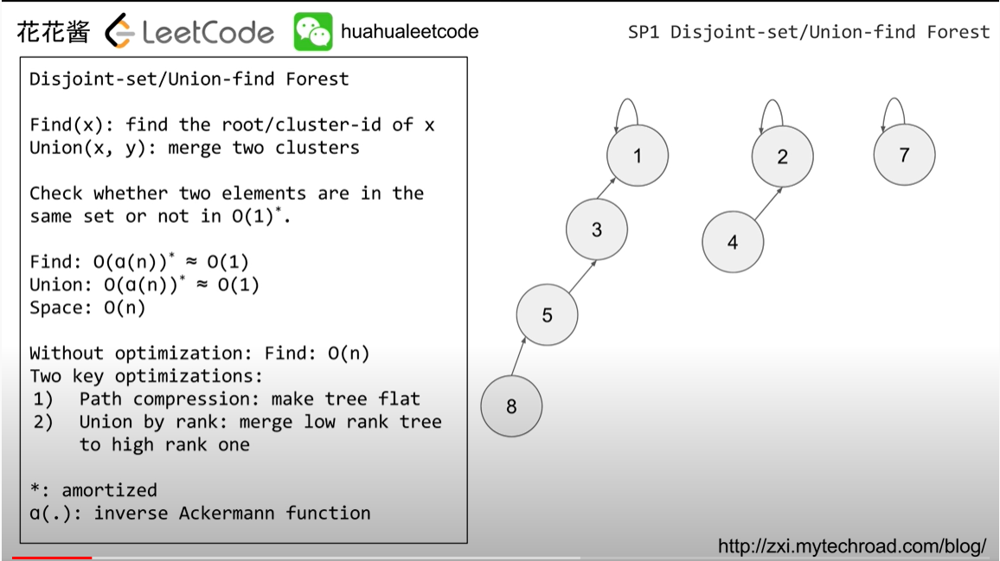
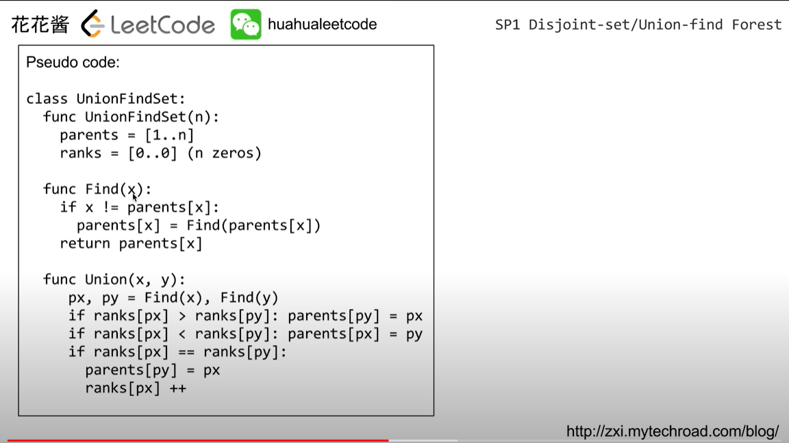

# My LC Template

## Union Find

参考：[花花酱](https://www.youtube.com/watch?v=VJnUwsE4fWA&t=791s)

## Overview



## Pseudo Code



## My Java code

```java
    class UnionFind{
        public int[] parent,rank;
        public int count;
        UnionFind(int n){
            parent=new int[n];
            rank=new int[n];
            for(int i=0;i<n;i++){
                parent[i]=i;
            }
            count=n;
        }
        
        public void union(int x, int y){
            int rootX=find(x);
            int rootY=find(y);
            if(rootX!=rootY){
                if(rank[rootX]<rank[rootY]){
                    parent[rootX]=rootY;
                }else if(rank[rootX]>rank[rootY]){
                    parent[rootY]=rootX;
                }else{
                    parent[rootX]=rootY;
                    rank[rootY]++;
                }
                
                count--;
            }
        }
        
        public int find(int x){
            if(parent[x]!=x){
                parent[x]=find(parent[x]);
            }
            return parent[x];
        }
        
        public int getCount(){
            return count;
        }
    }
```

## 一些变形

- 计算总共几个union set

  count初始化时不是总共element的个数，而是初始valid（符合题目要求）的数量
  
  (200. Number of Islands)
  
- 计算每个set的大小（最大set的size）

```java
public int maxSize(){
    int maxsize=0;
    int[] count=new int[parent.length];
    for(int i=0;i<parent.length;i++){
        count[find(i)]++;
        maxsize=Math.max(maxsize,count[parent[i]]);
    }
    return maxsize;
}
```

## 一些总结

union find适用于无向图？（323. Number of Connected Components in an Undirected Graph）

判断无向图是否有环（如果全部node都已经是同一个parent了，有任何多余一条edge都会形成环，所以用union find先梳理每个node的parent）684. Redundant Connection
